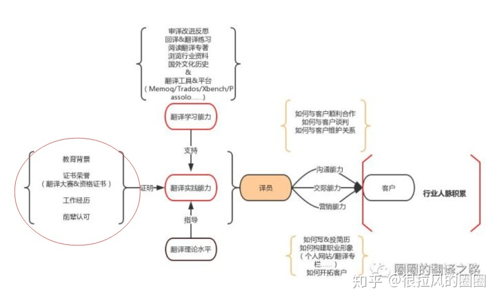

# 翻译篇

1. 翻译一个句子时，先划分它的句子成分，再按照译文习惯进行适当调整。
2. 翻译专有名词时，保留原有英文单词。
3. 可以的话，先通读全文，再翻译。做不到的话，至少先通读一段，再进行一个句子的翻译。
4. 适当增加连词（既然...那么）
5. 词组不能简单拆分翻译后简单组合为句子，要结合上下文语义。
6. 要记得形容词修饰人。
7. 双重否定翻译为肯定不（didn't necessarily make sense anymore）

## 校对

### 校对

校对，其实是对译文的简单检查过程，可通过**人工或机器**辅助来完成，一般就是看看是否有错译、漏译、标点符号错误、错别字、大小写、拼写错误、单复数、动词时态、数字错误、人名地名错误，等等。这些，具有一般英语基础的人都可以做，有些校对软件可以起到辅助作用。

指标：
- 错别字
- 语句是否通顺、简洁
- 错译
- 漏译

自我校对后，他人校对。

### 审校

审校呢，就要比校对高深多了，一般来说，审校人员要比翻译人员水平高，能够发现翻译人员所犯的错误，包括如上所述校对人员应该发现的错误，还有包括文章专业性，译文准确性等等问题，这是一般校对人员以及翻译人员自己都无法或没有能力发现的问题了。

## 语义翻译

### 一、理解种的选义

- 一词多义
- 虚实两用

如： run 一词

1. run across 跑过 ➡ 偶然碰见
2. run away 跑开 ➡ 失去控制
3. run back over 跑回 ➡ 回顾
4. run counter to 跑离 ➡ 违反，与......背道而驰
5. run down 跑下 ➡ 用完；撞倒；贬低
  
在汉语中，如“上”字

1. 上班 to go to work; to be on duty
2. 上报 to appear in the newspaper

在进行翻译时，除了使用字典外，我们要更多地借助于上下文。因此，翻译时先通读整个句子、段落、文章是很有必要的。

### 二、表达中的选词

### 三、翻译中的灵活性

### 四、翻译中的多样性

### 五、直译与意译

#### （一）词语

#### （二）成语

#### （三）谚语

going the extra mile 再加把劲 跑多一英里

#### （四）🍊

## 词法翻译

### 一、对等译法

#### （一）单词

### 二、具体译法

由于两种语言的差别，我们在翻译中不得不经常使用具体译法，也就是具体化的翻译方法。<u>所谓具体译法，，就是在翻译过程中把原文中抽象或者是比较抽象的单词、词组、成语或者句子用具体或者是比较具体的单词、词组、成语或者句子来进行翻译，</u>从而消除或降低语言差别给翻译带来的损失，使译文产生与原文同样的效果。

#### （一）单词、词组和成语英译汉时具体译法的译例

1. transportation 运输➡运输工具
2. advertisement 广告➡广告资料
3. propaganda 宣传➡宣传机关
4. translation 翻译➡翻译作品
5. government 政府➡政府官员

#### （二）单词、词组何成语汉译英时具体译法的译例

1. 大吵大闹 raise the roof
2. 公开认错 stand in a white sheet
3. 有花不完的钱 have enough money to burn

#### 句子译例

1. Since time has such different meaning <u>in different cultures</u>, communication if often difficult.
因为时间对于<u>不同文化背景的人</u>有如此多的不同的意义，相互间的交流常常会很困难。

### 四、增词译法

所谓增词译法，<u>就是在原文的基础上添加必要的单词、词组、分句或完整句，</u>从而使得译文在语法、语言形式上符合译文习惯和在文化背景、词语联想方面与原文一致起来，使得译文与原文在内容、形式和精神等3方面都对等起来。

1. After the football match, he's got an important meeting. 在**观看**足球比赛之后，他有一个重要会议**去参加**。（增加动词）

### 五、省词译法

所谓省词译法，<u>就是把原文中需要而译文中不需要的单词、词组等在翻译过程中加以省略。</u>这种省词译法一般是处于译文语法和习惯表达法的需要。从一定的意义上来讲，增词译法中的规律反过来就是省词译法的规律。请看下面的例子。

1. He is not well today, but he still comes to class. 他今天身体不好，但（他）还是来上课了。
2. If I learn to drive a motorcycle, I will certainly buy a new one. 我要是学摩托车的话，（我）就一定买一辆新的。

省略
- 关系代词
- 量词

### 七、转性翻译

转性译法谁英译汉和汉译英中都经常要用到的翻译方法。<u>所谓转译法就是在翻译过程中，根据译文语言习惯进行词性转换，如：把原文中的名词转换为动词，把原文中的副词转换为介词，等等。</u> 请看下面的实例。

1. Vietnamese War is a drain on American resource. 越南战争**不断地消耗**美国的资源。（名词转动词）
2. The government called for the establishment of more technical schools. 政府号召**建立**更多的技术学校。（名词转动词）

## 句法翻译

### 一、换序译法

英语和汉语在语法结构上有着许多差别。在翻译的过程中，我们经常需要更换原文词法的前后次序，对原文的词序照抄照搬，丝毫不顾译文的习惯，这样的机械性翻译，定会显得滑稽可笑，译文会丝毫无通顺可言，这也是新手通常会犯的错误，整个句子翻译下来看起来没什么毛病，但是读起来却感觉有点拗口。

**翻译时根据译文的语言习惯，对原文的词序进行调整，使译文做到最大程度上的通顺，这就是换序译法。**（ps: 汉语通常是重要的东西放到前面）
- 主语换序
- 主语从句换序
- 同位语换序
- 插入语换序
- 状语换序
  
请看下面的例子：（重新构造例子）

#### 状语换序

1. Components can initiate side effects <u>in lifecycle methods.</u>（状语换序）
组件在初始化生命周期方法时具有副作用
2. Send us a message <u>in case you have any difficulty.</u>（状语从句换序）
万一有什么困难，请给我们一封信。

反例：but I haven’t covered much <u>on how to implement a parser. </u> 这里不用换序，因为 on ... 作宾语。

### 二、断句译法

为了更好地翻译长句，我们可对其进行语法分析，<u>先找出句子的主语、谓语和宾语，然后找出修饰主语和宾语的定语和定语从句，以及修饰谓语的状语和状语从句。</u>理清句子的语法层次之后，就要按照译文的语言习惯调整搭配，恰如其分地断开长句进行翻译。

#### 拆开并列句

1. It is very easy to bring some books from the bookstores and libraries, <u>but to learn the knowledge in the books and put the knowledge into practice is by no means an easy job.</u>
从书店和图书馆带一些书回来是轻而易举的。// 然而，从书中学得知识并把这些知识运用到实践中去就绝不是那么简单的事情。

#### 拆开定语从句

1. After the war, his friend Kraemer got him a job as an instructor in an Army training school that paid $10,000 a year.大战结束后，他的朋友克莱摩介绍他到一所军事训练学校任教，// 年薪一万美元。

2. Just then the fish gave a sudden lurch <u>that pulled the old man down onto the bow</u>
正在这当儿，那条大鱼突然把船扯得晃荡了一下，// 老头儿给脱的倒向船头那边去。

### 五、缩句译法

### 六、转态译法

<u>所谓转态译法，就是在翻译过程中把原文中的被动语态转换成译文中的主动语态，或把原文中的主动语态转换成译文中的被动语态。</u>一般说来，无论是书面语中，还是口头语中，英语比汉语用更多的被动语态。<u>英语中那些用来被动语态的句子在翻译成汉语时，我们可以根据汉语的语言习惯把被动语态转换成主动语态；</u>汉语中用主动语态转换成被动语态。请看下面的实例：

> 1. She hadn't been told Bette's other name, or she'd forgotten it. **人家没告诉过她蓓蒂姓什么**，要不然也许是她忘了。

### 七、正反译法
